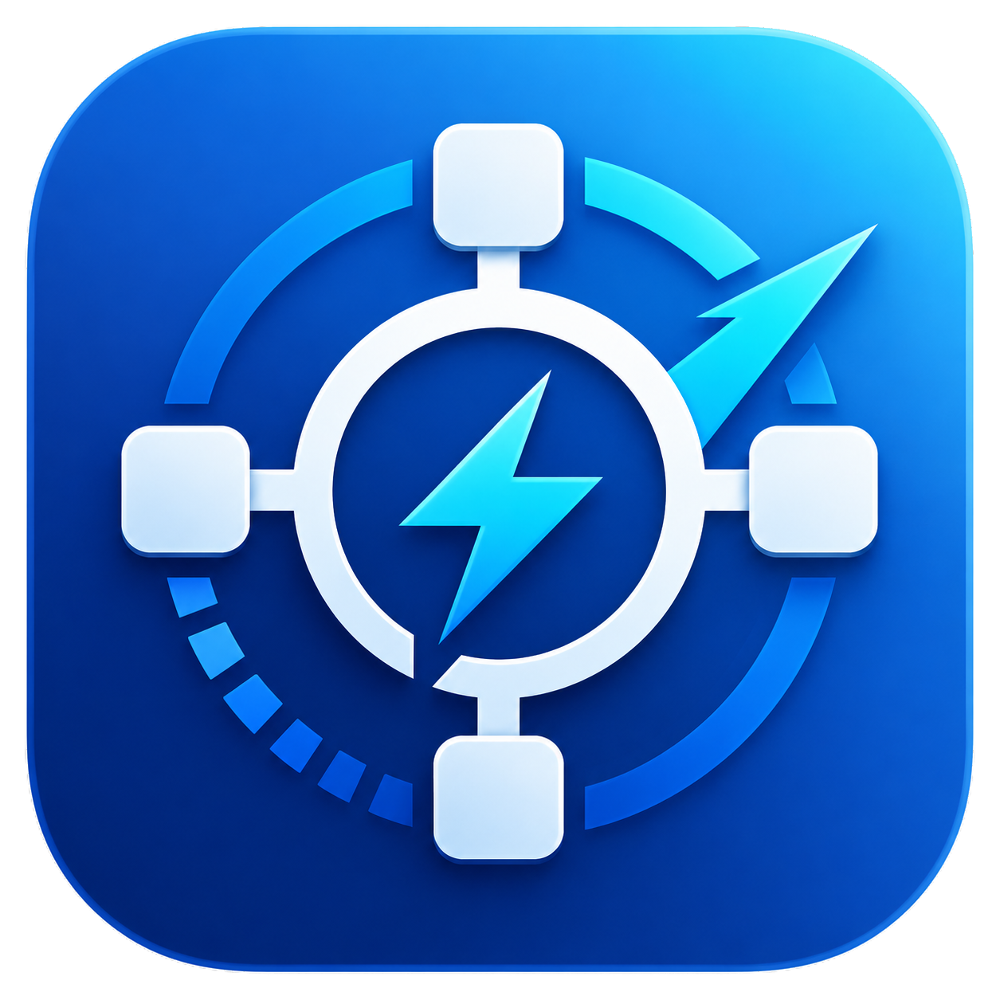

<p align="center">
  
</p>

<h1 align="center">Windows Mini Hub</h1>

<p align="center">
  A desktop setup hub for fresh Windows installs.
  <br />
  Install apps, apply safe Windows tweaks, check what is already installed, and keep everything visible in live logs.
</p>

<p align="center">
  <a href="https://github.com/bdfyff/windows-mini-hub/releases/latest">
    
  </a>
  
  
</p>

---

## Download

Download the latest `.exe` from:

[github.com/bdfyff/windows-mini-hub/releases/latest](https://github.com/bdfyff/windows-mini-hub/releases/latest)

Recommended file:

```text
Windows Mini Hub-Setup-0.2.2-x64.exe
```

Portable build is also available if you prefer running the app without installation:

```text
Windows Mini Hub-Portable-0.2.2-x64.exe
```

## What It Does

Windows Mini Hub helps you prepare a clean Windows installation without jumping between websites, installers, settings pages, and command prompts.

- Pick apps from a curated catalog.
- Install supported apps through WinGet.
- Download official direct installers and GitHub release assets.
- Skip apps that are already installed.
- Apply safe user-level Windows tweaks.
- See live logs, current task, progress, errors, and post-run summaries.
- Save app selections as profiles like Gaming, Developer, Clean Windows, or My setup.
- Export diagnostics when something does not install correctly.

## Main Features

### Dashboard

A compact first screen with your setup status, selected apps, installed apps, recommended presets, system checks, and last run summary.

### Apps

Search, filter, select, scan, install, download, retry failed items, and inspect details before anything runs.

Supported source types:

| Source | Behavior |
| --- | --- |
| WinGet | Installs using official WinGet package IDs |
| Microsoft Store | Installs Store apps through WinGet |
| GitHub Releases | Downloads selected release assets |
| Direct URL | Downloads official installer files |
| Manual | Shows that an official source is required before automatic install |

### Tweaks

Safe Windows tweaks with descriptions, risk badges, groups, and confirmation before applying.

Included examples:

- Show file extensions
- Enable dark mode
- Enable clipboard history
- Show hidden files

No aggressive debloat, no disabling Windows Defender, and no destructive system changes.

### Logs

Live terminal-style logs with timestamps, colored statuses, copy/clear buttons, floating activity panel, and current running task.

### Settings

Theme, compact mode, animations, portable mode, downloads folder, admin status, restart as administrator, diagnostics export, version info, and update check.

## Included App Categories

- Archivers
- Games and launchers
- Communication
- Browsers
- Remote access
- Utilities
- Drivers
- Developer tools
- Runtimes

Examples include Chrome, Firefox, VS Code, Git, Node.js LTS, Python, .NET SDK, 7-Zip, WinRAR, Discord, Steam, Epic Games Launcher, VLC, Notepad++, PowerToys, AnyDesk, DirectX Runtime, Microsoft Visual C++ Redistributable, NVIDIA App, osu! lazer, and more.

## Safety

Windows Mini Hub is built with a narrow command surface.

- The UI does not get direct Node.js access.
- Commands run only in the Electron main process.
- The renderer sends only selected app IDs or tweak IDs.
- The main process resolves commands from an internal allowlist.
- Manual apps are not installed automatically until a trusted official source is configured.
- Source domains are shown before direct downloads.
- GitHub release assets can be reviewed before downloading.
- System commands may require administrator rights.

## Requirements

- Windows 10 or Windows 11
- WinGet installed and working
- Internet connection for downloads
- Administrator rights for some installers and tweaks

## For Developers

This section is only for contributors who want to run the project from source.

```bash
npm install
npm run dev
```

Production build:

```bash
npm run build
npm run dist
```

## Tech Stack

- Electron
- React
- Vite
- TypeScript
- Tailwind CSS
- shadcn/ui-style local components
- Node.js `child_process`
- WinGet
- PowerShell
- electron-builder

## Roadmap

- Signed releases
- More detection rules
- More official app icons
- Full auto-update support
- More curated setup profiles

## License

License will be added before a stable public release.
